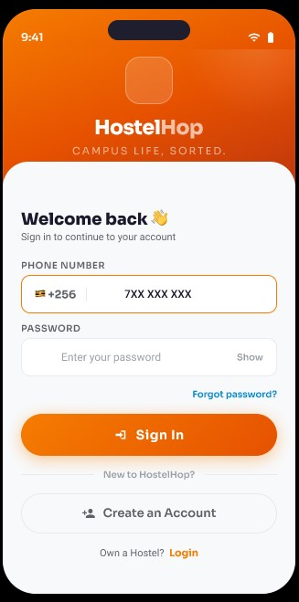
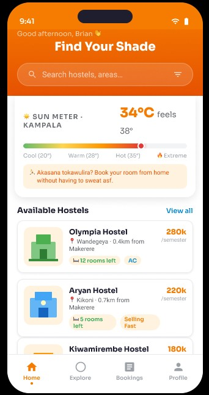

# HostelHop Mobile

[](#tech-stack)
[](#tech-stack)
[](#current-product-stage)
[](#license)

**Campus Life, Sorted.**

HostelHop is a modern mobile application designed to streamline the student accommodation experience. Built with Flutter, it provides a seamless journey from discovering hostels near campus to booking and managing payments, specifically tailored for the mobile-first student market.

---

## 📸 Screenshots

| Splash & Branding | Authentication | Discover Hostels |
| :---: | :---: | :---: |
|  |  |  |
| *Visual identity & splash* | *Local auth flows (Uganda)* | *Real-time hostel listings* |

---

## ✨ Core Features

- **Smart Discovery:** Find hostels near your campus with real-time distance tracking and availability.
- **Sun Meter:** Integrated weather awareness (powered by OpenWeatherMap) to help you "Find Your Shade" in Kampala's heat.
- **Integrated Payments:** Mobile money-inspired checkout flows designed for the local context.
- **Rich Details:** View room amenities, pricing per semester, and remaining inventory at a glance.
- **Modern UI:** A polished, high-performance interface with dark/light mode support and smooth animations.

---

## 🛠 Tech Stack

- **Framework:** [Flutter](https://flutter.dev) (Dart)
- **State Management:** [Riverpod](https://riverpod.dev)
- **Navigation:** [go_router](https://pub.dev/packages/go_router)
- **Backend-as-a-Service:** [Supabase](https://supabase.com) (Auth, Database, Storage)
- **Maps & Location:** Google Maps Flutter & Google Places
- **Real-time Services:** OpenWeatherMap API, Firebase Cloud Messaging
- **Animation:** Flutter Animate & Smooth Page Indicator

---

## 📂 Project Structure

```text
lib/
├── app.dart              # Main application widget & router setup
├── main.dart             # Entry point & provider initialization
├── core/                 # Shared constants, theme, and utilities
├── data/                 # Data models and mock repository layer
├── features/             # Business logic organized by feature (Auth, Hostels, etc.)
├── providers/            # Global state providers (Riverpod)
├── screens/              # UI Screen implementations
├── services/             # External service integrations (Supabase, Weather, FCM)
└── widgets/              # Reusable UI components
```

---

## 🚀 Getting Started

### Prerequisites

- Flutter SDK (latest stable)
- Dart SDK
- Android Studio / Xcode
- A physical device or emulator

### Installation

1. **Clone the repository**
   ```bash
   git clone <repository-url>
   cd hostelhop_mobile
   ```

2. **Install dependencies**
   ```bash
   flutter pub get
   ```

3. **Configure Environment**
   Create a `.env` file in the root directory (refer to `.env.example` if available) with your Supabase and API credentials.

4. **Run the application**
   ```bash
   flutter run
   ```

---

## 🗺 Roadmap

- [ ] **Live Backend Integration:** Fully wire Supabase for persistent data and auth.
- [ ] **Real-time Search:** Advanced filtering by price, amenities, and campus proximity.
- [ ] **Booking Lifecycle:** In-app management of active, pending, and past bookings.
- [ ] **Direct Messaging:** Chat directly with hostel custodians/operators.
- [ ] **Verified Reviews:** Student-driven rating system for hostels.

---

## 📄 License

This project is proprietary and not licensed for public reuse, modification, or distribution. See `LICENSE` for details.
